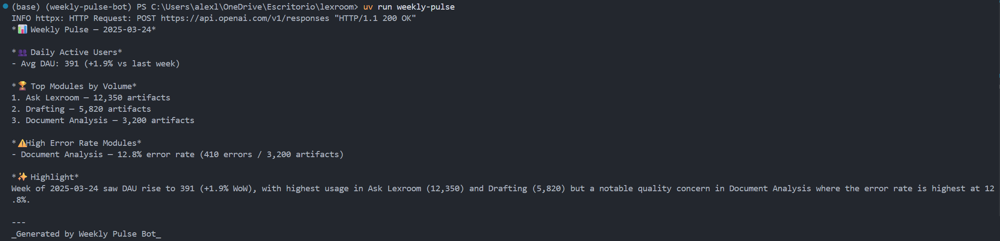
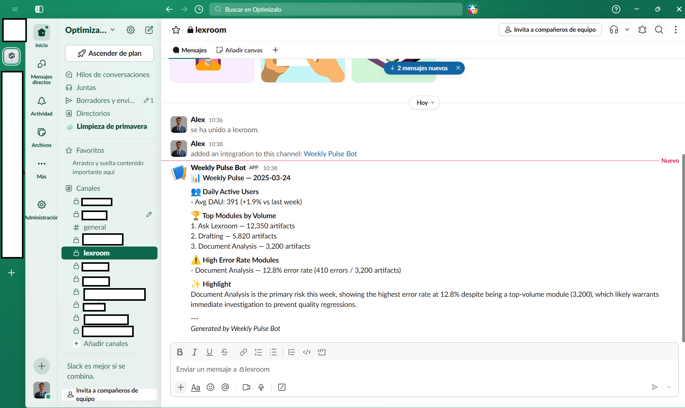

# Weekly Pulse Bot

Generates a weekly product usage report — DAU trends, top modules by volume, error-rate flags, and an LLM-generated one-sentence highlight — and delivers it to the console or a Slack channel.

## Output

**Terminal**



**Slack**



---

## Running it

**Requirements:** Python 3.11+, [uv](https://docs.astral.sh/uv/)

```bash
git clone <repo>
cd weekly-pulse-bot
uv sync
cp .env.example .env
# edit .env with your keys (see below)
uv run weekly-pulse
```

By default (`DELIVERY_MODE=console`) the report prints to stdout. To post to Slack, set `DELIVERY_MODE=webhook` and add your `SLACK_WEBHOOK_URL`.

**Run the tests:**

```bash
uv run pytest
```

All tests pass with zero warnings (enforced via `filterwarnings = ["error"]`).

---

## Configuration

All settings are loaded from environment variables or a `.env` file.

| Variable | Default | Description |
|---|---|---|
| `OPENAI_API_KEY` | _(none)_ | OpenAI key for the LLM highlight. Optional — the report works without it. |
| `SLACK_WEBHOOK_URL` | _(none)_ | Required when `DELIVERY_MODE=webhook`. |
| `DELIVERY_MODE` | `console` | `console` prints to stdout; `webhook` posts to Slack. |
| `ERROR_RATE_THRESHOLD` | `0.05` | Modules with error rate above this are flagged. |
| `TOP_N_MODULES` | `3` | How many top modules by artifact volume to show. |
| `LLM_MODEL` | `gpt-5.4-nano-2026-03-17` | OpenAI model for the highlight sentence. |
| `LLM_TIMEOUT_SECONDS` | `10.0` | Timeout for the OpenAI API call. |
| `WEBHOOK_TIMEOUT_SECONDS` | `5.0` | Timeout for the Slack webhook POST. |
| `DATA_DIR` | `data` | Directory containing `week_current.json` and `week_previous.json`. |

---

## Architecture

The pipeline has four isolated layers with no cross-contamination between them.

```
JSONFileLoader  →  compute.py  →  LLMHighlightGenerator  →  SlackMarkdownFormatter  →  ConsoleDelivery
   (loaders/)     (analytics/)        (llm/)                    (formatters/)            (delivery/)
                                                                                      →  WebhookDelivery
```

**Ingestion (`loaders/`)** reads JSON files and validates them into typed `WeekData` models via Pydantic. The `DataLoader` abstract base class is the only contract the rest of the pipeline knows about — swapping to a `BigQueryLoader` requires zero changes downstream.

**Computation (`analytics/`)** is pure functions with no I/O and no side effects. `compute_dau_stats`, `rank_modules`, and `flag_error_modules` take typed models and return typed models. Fully deterministic and trivially testable without mocking anything.

**LLM enrichment (`llm/`)** calls the OpenAI Responses API for a one-sentence highlight. This layer is explicitly best-effort: any failure (missing key, timeout, rate limit, API error) returns `None` and logs a warning. `generate()` never raises. The report is fully readable without it.

**Formatting + Delivery (`formatters/`, `delivery/`)** are orthogonal concerns kept separate intentionally. `SlackMarkdownFormatter` renders to a string; `ConsoleDelivery` and `WebhookDelivery` send it somewhere. Adding email or PagerDuty requires only a new `DeliveryChannel` subclass — no changes to the formatter or the pipeline.

---

## Libraries

| Library | Why |
|---|---|
| [pydantic v2](https://docs.pydantic.dev/) | Typed model validation for all data structures. `@computed_field` ensures `error_rate` is included in serialization, not just at runtime. |
| [pydantic-settings](https://docs.pydantic.dev/latest/concepts/pydantic_settings/) | Config loaded from env vars and `.env` with full type coercion and validation. |
| [openai](https://github.com/openai/openai-python) | OpenAI Responses API (`client.responses.create`) for the LLM highlight. |
| [httpx](https://www.python-httpx.org/) | HTTP client for the Slack webhook POST. Explicit dependency even though openai pulls it in transitively, because `webhook.py` uses it directly. |
| [pytest](https://docs.pytest.org/) + [pytest-mock](https://pytest-mock.readthedocs.io/) | Test suite. `pytest-mock` is used to patch the OpenAI client and `httpx.post` without real network calls. |

The LLM highlight uses `gpt-5.4-nano-2026-03-17`, a non-reasoning GPT-5.4 model chosen for low latency and cost: no reasoning-token overhead, and the 120-token output budget is fully available for visible text.

---

## What I'd do with more time

**BigQuery loader** — replace `JSONFileLoader` with a `BigQueryLoader` that reads from the product analytics warehouse. The `DataLoader` interface is already the only seam needed; no downstream code changes.

**Async pipeline** — the LLM call and the analytics computation are independent. Running them concurrently with `asyncio` would cut wall-clock time roughly in half.

**Monday morning cron** — a GitHub Actions workflow on a weekly schedule running `uv run weekly-pulse` and posting directly to Slack. The bot becomes self-operating.

**Structured logging** — replace `logging.basicConfig` with `structlog` for JSON log output. Useful the moment this runs in any environment where logs are aggregated (CloudWatch, Datadog, etc.).

**Multi-workspace support** — per-workspace Slack webhook configuration for multi-tenant deployments, driven from a config file rather than a single env var.

---

## AI usage disclosure

### AI tools used

The entire implementation was written by **Claude Code** using the **claude-sonnet-4-6** model (Anthropic, 2025). No other AI tools were involved.

### How they were used

I used Claude in the browser to craft a detailed prompt laying out the problem, constraints, and goals. I then ran that prompt in Claude Code to think through the implementation approach — architecture decisions, trade-offs between layers, edge cases — before writing a single line of code. Claude Code asked me a few clarifying questions to resolve ambiguities in the spec, and once we'd aligned on the design, I instructed it to write the full plan into `plan.md` as the authoritative implementation contract.

With the plan locked, I opened a fresh terminal session and ran Claude Code again to implement it end-to-end. Every file in `src/weekly_pulse/` and `tests/` was generated from that plan: `models.py`, `config.py`, the four sub-packages (`loaders`, `analytics`, `llm`, `formatters`, `delivery`), `main.py`, and all test modules. `README.md` was also AI-generated. No code was written or adjusted manually after generation.

One issue required autonomous diagnosis: the CLI threw a `UnicodeEncodeError` on Windows because the cp1252 console encoding cannot represent emoji characters. The formatter outputs Slack-flavoured markdown with emoji (📊, 👥, etc.), and `print()` in `ConsoleDelivery` used the system default encoding. The fix was a single call to `sys.stdout.reconfigure(encoding="utf-8")` at the top of `main()` — not in the plan, identified from the runtime error.


